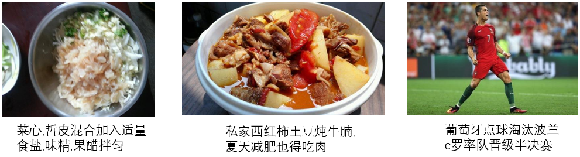
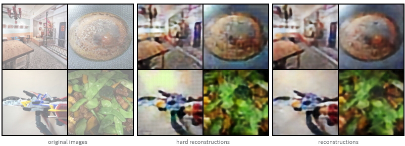
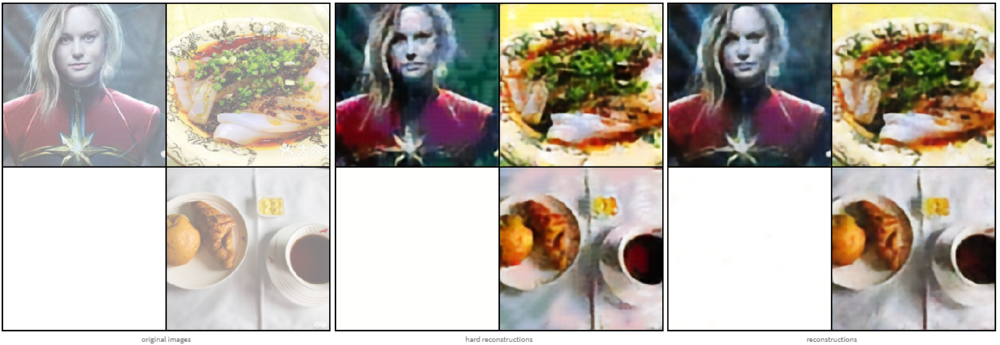
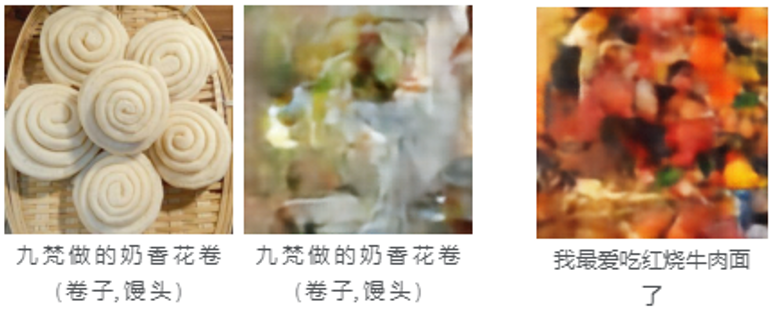
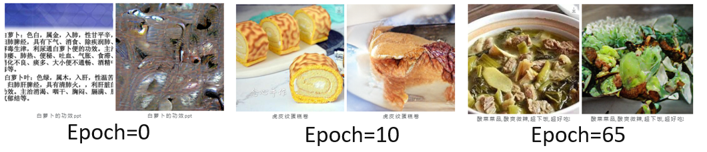
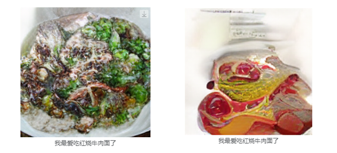
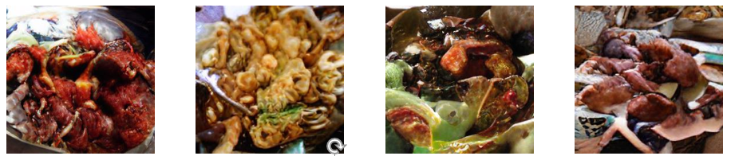

# BriVL-Generation

## Introduction

This project includes the code for BriVL/CLIP to generate images using VQGAN and DALLE, which is the image generation part of our paper **New Audio Representations Image Gan Generation from BriVL**.

This is the basic work of the text generating image we mentioned, and **it's our reference code**, don't get confused. The code is sourced from multiple open source repositories and is referenced at the end of the article.


## Illustration of ICASSP Workshop 2023


### Code description

text2img's intro：

- Based on Wukong Chinese open source data set, CLIP image and text retrieval model, VQVAE image encoding and decoding model training, VQVAE+VQGAN, VQGAN+DALLE image generation model training, open source Chinese image and text retrieval model BriVL and self-training CLIP performance comparison.
- Finally, this basic work used VQGAN's DALLE model training to realize the text generation image, and used BriVL to rearrange the generated results. For example, the following food generation results are the inspiration for us to use volunteers to experiment with the relevance of food.

Again, this is the text generated image part of our reference code, don't get confused, the following introduction is **for text2img only**.
our work in paper are slightly different from the following code, which is audio guided generation in our paper by using [WavBriVL](https://github.com/FangSen9000/WavBriVL) on the text2img.

### Environmental dependence

- Primarily based on the pytorch environment
- The specific environment depends on the README under each project

### Directory structure & Important code files

```
│  README.md
│  dalle_gen.py  Call the trained DALLE model and specify the text to generate the corresponding image
│  clip_sort.py  Call BriVL to rerank the generated results
├─form_data
│  ├─dealData_wukong.ipynb  Download, clean and partition the original data of wukong train&val
│  └─foodNames.txt  Food keywords, used to filter food-related image and text pairs from wukong data
├─open_clip   CLIP model training program
├─BriVL-code-inference  BriVL model inference code
│  
└─DALLE-pytorch  VQVAE model training DALLE model training

```

### Run

- Training CLIP model

  ```
  cd open_clip
  nohup python  -u  -m torch.distributed.launch --nproc_per_node=4  src/training/main.py \
    --save-frequency 10 \
    --report-to wandb \
    --train-data="../train_clean.csv"  \  
    --val-data="../val_clean.csv"  \
    --csv-img-key filepath \
    --csv-caption-key title \
    --batch-size=64 \
    --lr=1e-4 \
    --wd=0.1 \
    --epochs=30 \
    --workers=4 \
    --horovod  \
    --model RN50 >log 2>&1 &
  ```

- Training VQVAE model
  
  ```
  cd DALLE-pytorch
  nohup python -u train_vae.py \
    --image_folder=训练所用存放图像文件的目录 \
    --batch_size=64 \
    --num_layers=4 \
    --num_tokens=1024 \
    --emb_dim=256 \
    --image_size=256 >vae.log 2>&1 &
  ```

- Training DALLE model

  ```
  cd DALLE-pytorch
  nohup python -u train_dalle.py
    --image_text_folder=./DALLE.train.jsonl
    --vae_path= 训练得到的VQVAE模型位置 
    --chinese 
    --amp 
    --dalle_output_file_name=vae_dalle >dalle.log 2>&1 &
  ```

- Use BriVL for reasoning

  ```
  更新BriVL-code-inference/cfg/test_xyb.yml中的JSONPATH
  cd BriVL-code-inference/evaluation
  sh evaluation.sh
  ```

- Using DALLE to generate images & BriVL reasoning

  ```
  python dalle_gen.py [text] [img_num] [save_path]
    //Image generation based on sentences

  python clip_sort.py [text] [img_num] [save_path]
    //Calculate the similarity based on sentences and images, and output the sorted results
  
  parameter：
    text：//Input food-related sentences, preferably longer than 10
    img_num：//Number of generated images
    save_path：//Image storage address
  ```

### Experimental process

> The following is the experimental process taking the text generation diagram as an example.
> The following images are all screenshots, not original generated images.

#### **Data prediction processing**

Data set: WuKong Huawei Noah's open source Chinese image and text data set, including 100 million Chinese image and text pairs from the network.

For the sake of training convergence speed, we limited the image domain used in this experiment, filtered the keywords in the image caption through the vocabulary, and selected the food-related images. In addition, filter data samples with a caption length greater than 32, a caption containing special characters, an image aspect ratio greater than 3, and an image size too small.

Finally, 51k samples were obtained from the first ten files of WuKong dataset (10/255, 3.9M pairs in total); The train-validation dataset is divided by 9:1, as shown in the following table:

| Type  | Size  |
| ----- | ----- |
| train | 45975 |
| val   | 5112  |

The correlation between the image and text of the obtained data is relatively strong as a whole, but the range of pictures is not limited to food subjects (the right figure below).



#### **Experiment 1: VQVAE+DALLE model training**

1. VQVAE training results

- Train on V100, 40min, resolution=128


- Train on V100, 36min, resolution=256


2. DALLE model training results based on VQVAE
-The two images on the left are the original image of the training process and the generation results based on image captions; The right figure shows the generated results based on text input



#### **Experiment 2: Open source VQGAN+DALLE model training**

Training results

Train on V100, 25.37h, resolution=256（train loss未完全收敛）





#### **Experiment 3: VQGAN+DALLE+BriVL**

Input text: This bowl of braised beef noodles has a lot of meat, which is really delicious.

- VQGAN+DALLE  Random 4


- VQGAN+DALLE+BriVL  Top 4




### Related resources

- wukong DataSet：https://wukong-dataset.github.io/wukong-dataset/benchmark.html
- Open source pre-training used VQGAN：https://heibox.uni-heidelberg.de/f/140747ba53464f49b476/?dl=1
- Chinese text tokenizer：https://huggingface.co/hfl/chinese-roberta-wwm-ext

### Reference items

- https://github.com/mlfoundations/open_clip
- https://github.com/BAAI-WuDao/BriVL
- https://github.com/lucidrains/DALLE-pytorch
- https://github.com/ZYiJie/text2img
